# LogAnalyzer
Log Analyzer -  Analyses the customer logs for bigdata components like HDFS, Hive, HBase, Yarn, MapReduce, Storm, Spark, Spark 2, Knox, Ambari Metrics, Nifi, Accumulo, Kafka, Flume, Oozie, Falcon, Atlas & Zookeeper.

## Internal Architecture

Analysing the Customer logs, for understanding the issue is a time consuming process. For a bigdata issue, the support engineer need to slice and dice the logs from various components across different nodes to understand the issue. There are many paid products available that helps in analysing these logs. Here we use the the Ambari Log Search Feature to analyse the logs. The Amabri Log Search is used to analyse the logs in a cluster and it expects all the components to be installed so that it will check the issues of the installed components in that cluster. This project creates the docker containers based on the nodes/hostnames provided by Customer and setup the Amabri Log Search in it and Ambari Log Search will be using the customer logs.

Consider a customer has a 20 node hadoop cluster and having issues with namenode(node1.test.com) and 2 datanode (node12.test.com, node15.test.com). The support engineer has to share the log collector script (bin/logCollector.sh) to customer. Customer run the script that will collect the logs from 3 nodes (node1.test.com, node12.test.com, node15.test.com). The customer shares the zipped artifact to support engineer. 

The support engineer run the bin/setup.sh and share the path for the collected artifact. This script will create 3 docker containers for each node (node1.test.com, node12.test.com, node15.test.com). The container name will be same as host name. Here the script take the first container (node1.test.com) and setup the ambari server. Ambari agents will be installed in rest all the container. Then the script creates the ambari blueprints and install the Log Search. Only dependent components for Log Search will be installed in the cluster. After the installation, the script will update the Log Search to point to customer logs. This script takes 10-15 mins to setup the Log Analyzer. 

The Support Engineer uses he URL http://HostIP:61888/login.html to analyze the logs. The credentials are admin/passw0rd
The Support Engineer can login to Amabri Server (http://HostIP:8080/) using credentials admin/passw0rd
The Support Engineer can login to these containers or Ambari nodes from linux terminal using ssh -p assignedPort root@localhost
The assignedPort and login details for each containers are updated in conf/serverConnectionDetails & conf/agentConnectionDetails

After analysing the logs, Support Engineer will run bin/kill_all.sh that will kill/remove these containers.

### Usage

**1) bin/logCollector.sh** - Used by customer to collect the logs. Customer need to provide the case details, issue details, date when the issue occurred, components for which logs to be collected, nodes for which logs to be collected and path where the final artifact to be generated. Based on the customer input the script will collect the logs.
 
  
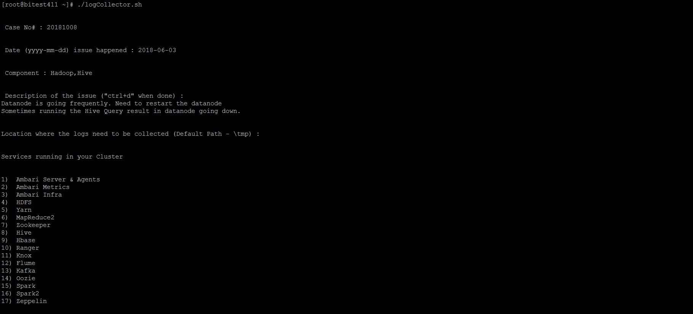
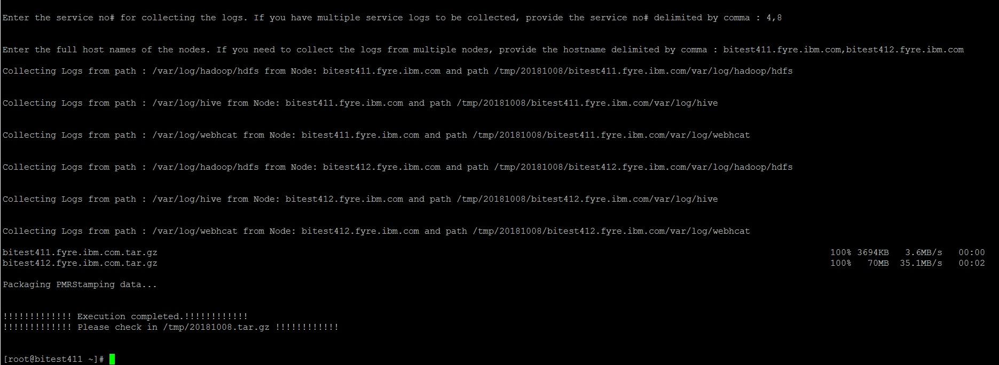
 
 
**2) bin/setupDocker.sh**  - Used to setup the Docker in a fresh Linux Machine.

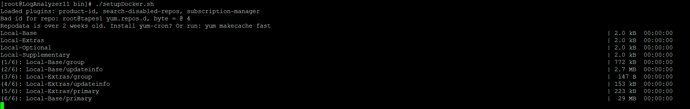
 
 
**3) bin/setup.sh** - Used to setup the cluster based on customer nodes and distribute the customer logs for log analysis. The support engineer need to provide the path for the customer logs & URL for ambari.repo file. 

The path for Ambari repo is available in Hortonworks URL (https://docs.hortonworks.com/HDPDocuments/Ambari-2.6.1.5/bk_ambari-installation/content/ambari_repositories.html )
 
 
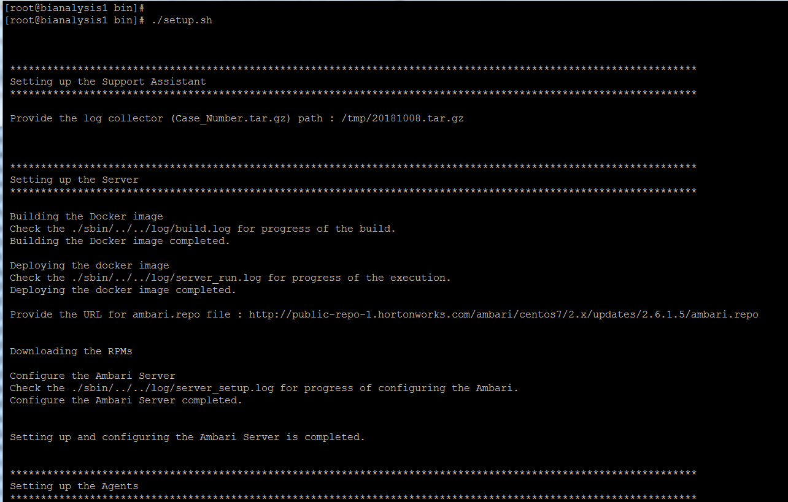
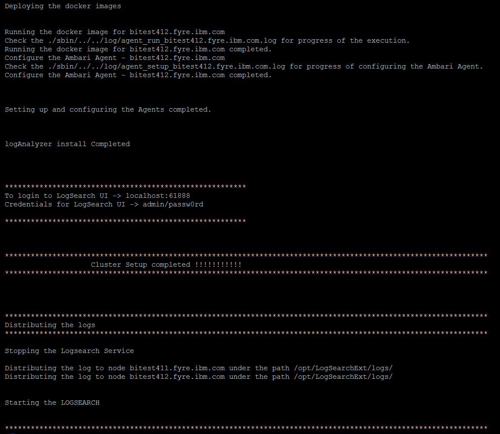
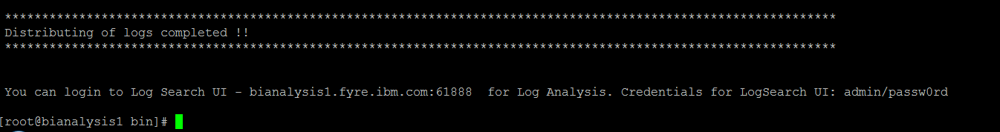
   
   
   
   
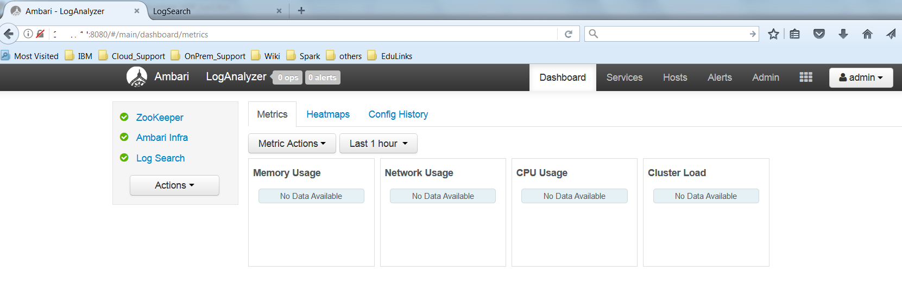
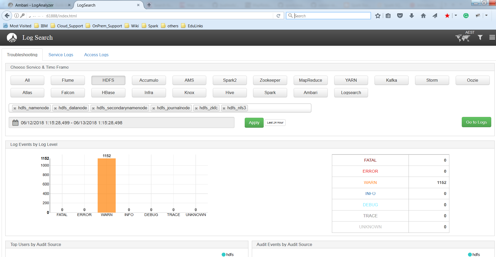
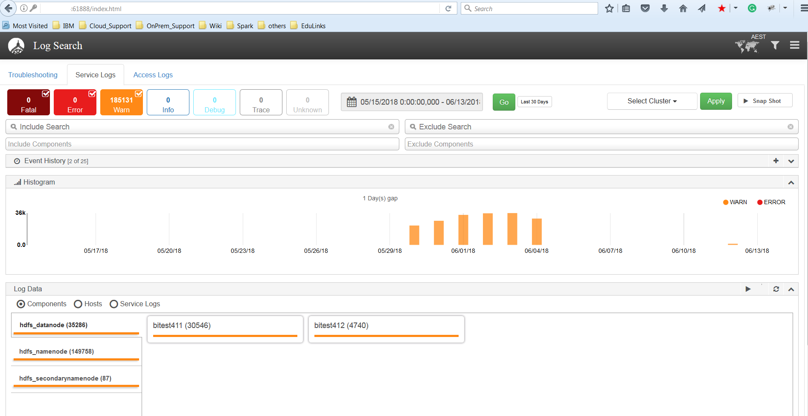
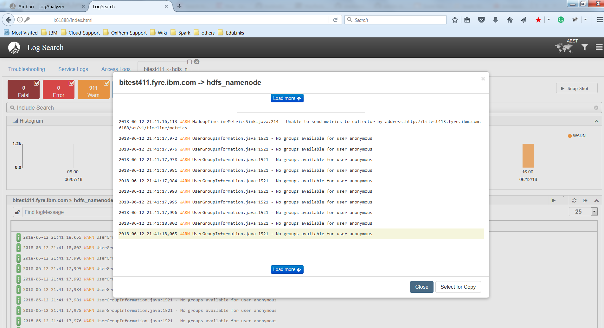
 
 
**4) bin/setupCluster.sh** - Used for setup the cluster based on the nodes mentioned in configuration files. The Amabri server container will be created based on the hostname mentioned in conf/server. The Ambari agent containers will be created based on conf/agent. This script will install only the Ambari Log Search and its dependent components. If support engineer need to replicate the issue, he/she can manually do it from Ambari UI.
 
 
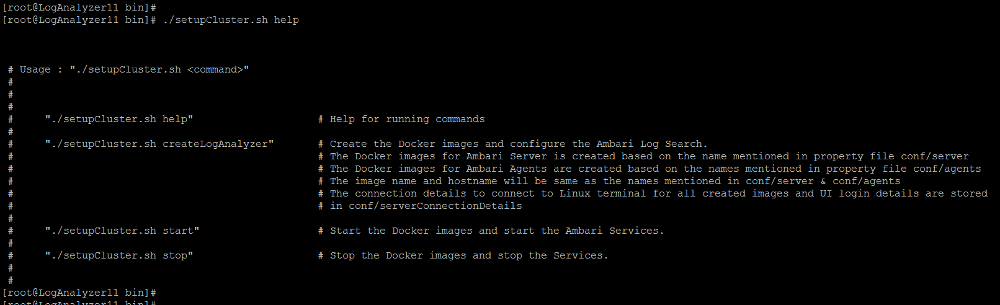
 
 
*bin/setupCluster.sh createLogAnalyzer*
  
  
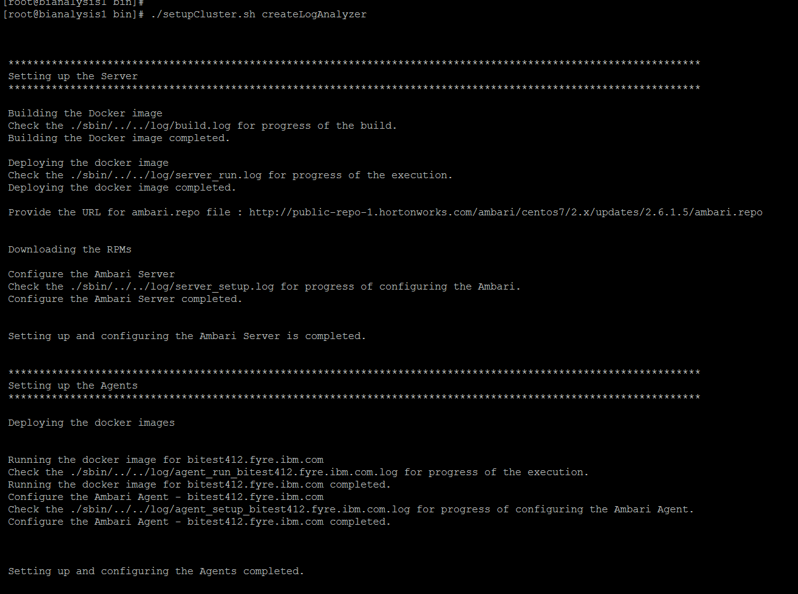
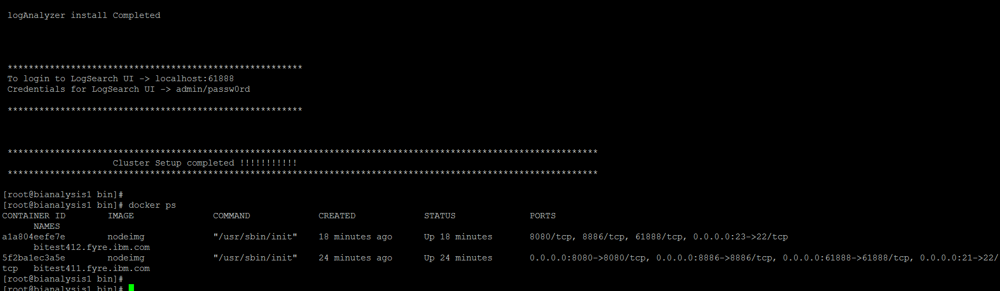
  
  
*bin/setupCluster.sh stop*
  
  
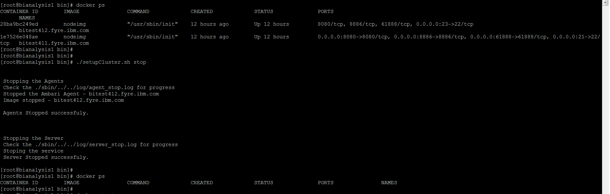
  
  
*bin/setupCluster.sh start*
  
  
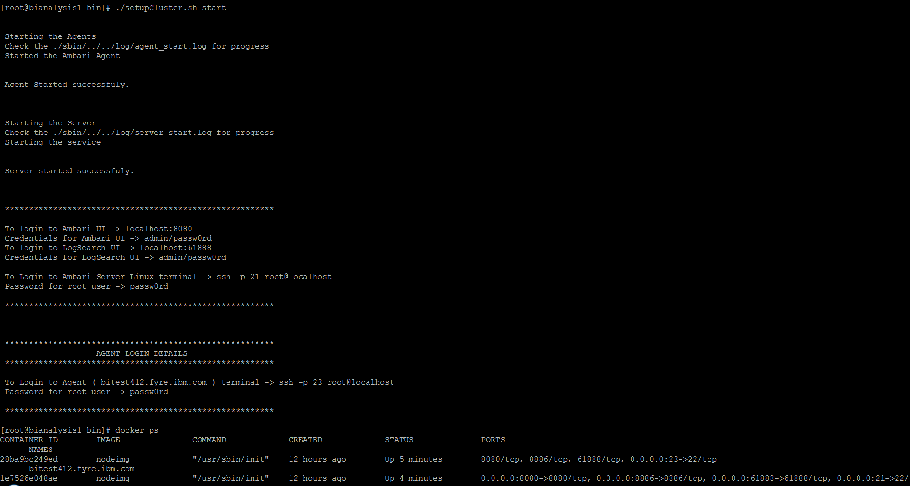
  
  
**5) bin/logDistribute.sh** - Used for distributing the customer logs to existing cluster. If the Support engineer uses the bin/setupCluster.sh createLogAnalyzer to setup the cluster, then to distribute the customer logs, support engineer has to run the log distribute script.
  
  
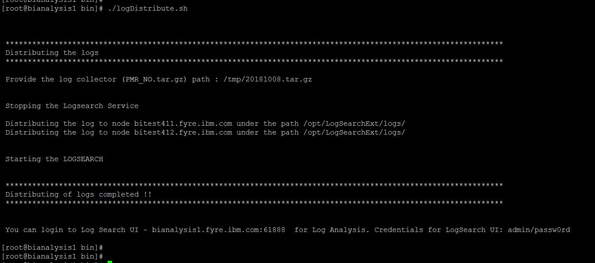
  
  
**6) bin/kill_all.sh** - Used to kill the containers created by log analyser.
  
  
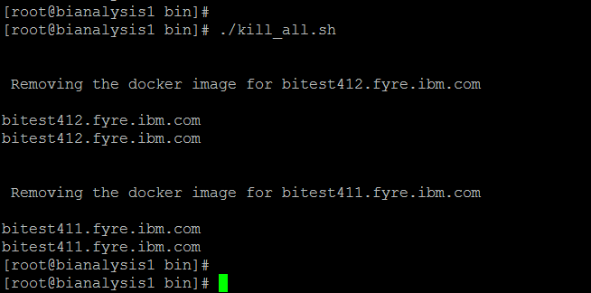
  
  
  
## Author

**Nisanth Simon** - [NisanthSimon@LinkedIn]

[NisanthSimon@LinkedIn]: https://au.linkedin.com/in/nisanth-simon-03b2149
 

